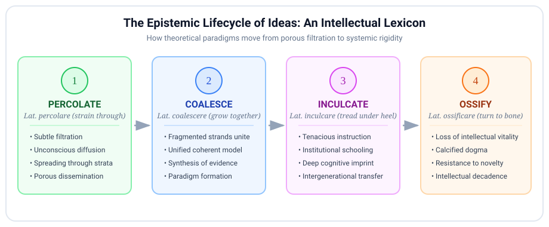

# Introduction

In elevated essayistic prose, academic monographs, and philosophical critique, ideas are rarely treated as static objects. Instead, intellectuals discuss concepts as dynamic physical substances that undergo fluid filtration, crystalline synthesis, forceful behavioral stamping, and biological calcification.

When writing or speaking at an advanced level, moving beyond generic verbs like *"spread"*, *"combine"*, *"teach"*, or *"harden"* is essential. This masterclass deconstructs the four premier dynamic verbs of intellectual life: **percolate**, **coalesce**, **inculcate**, and **ossify**.

***

## The Epistemic Lifecycle of Ideas

Ideas follow a recognizable trajectory through intellectual history—from their initial porous filtration through cultural strata to their eventual institutional petrification:

{fig-align="center" width="100%"}

---

## 1. Percolate (Intransitive & Transitive Verb)

**Phonetics:** /ˈpɜːrkəleɪt/

### Etymology and Morphological Roots
Derived from the Classical Latin ***percolare***, formed by the prefix *per-* ("through, thoroughly") and the verb *colare* ("to strain, filter, sieve," from *colum*, a wicker strainer or colander). 

In its physical sense, it describes liquid trickling through a permeable or porous matrix (as in brewing coffee). In intellectual discourse, it describes the **gradual, subterranean, and osmotic filtration of concepts, moods, or theories through collective consciousness or academic strata**.

```text
              [ THE PERCOLATION CASCADE ]

    Fringe Philosophical & Academic Research
                       │  (filters through)
                       ▼
       Specialized Seminars & Literary Journals
                       │  (slow seepage)
                       ▼
       Popular Press, Media, & Public Consciousness
```

### Semantic Core & Syntactic Behavior
To **percolate** is for an idea to spread quietly and unhurriedly beneath the surface before reaching critical mass, or for a creative thought to mature subconsciously in a thinker's mind.

#### Syntactic Formulations
*   *Intransitive + Preposition (*through*, *down*, *into*)*: 
    *   *"Postmodern literary theory slowly **percolated through** undergraduate curricula in the 1980s."*
*   *Reflexive / Subconscious incubation*:
    *   *"She chose not to write immediately, allowing the core thesis to **percolate** for several months."*

### Diffusion Contrast Matrix

| Lexical Item | Operative Mechanism | Medium of Movement | Distinctive Register |
| :--- | :--- | :--- | :--- |
| **Percolate** | Gradual, porous filtration from above or beneath. | Through social strata, institutions, or subconscious. | Elevated / Intellectual |
| **Permeate** | Complete, pervasive saturation of a space. | Throughout every crevice of a culture or system. | Standard / Formal |
| **Diffuse** | Passive spreading from high to low concentration. | Across borders, populations, or disciplines. | Scientific / Analytical |
| **Simmer** | Heat and emotional tension held just below boiling. | Collective grievance, anger, or brewing conflict. | Metaphorical / Standard |

### High-Register Collocations
*   *Ideas percolating beneath the surface...*
*   *To allow a concept to percolate...*
*   *The findings have begun to percolate into policy circles...*

> **Model Sentence:** Decades before the economic reforms were officially ratified, market-oriented principles had already begun to **percolate** through the junior ranks of the civil service.

***

## 2. Coalesce (Intransitive Verb)

**Phonetics:** /ˌkoʊəˈlɛs/

### Etymology and Morphological Roots
From Latin ***coalescere*** ("to grow together, unite"), compounding *co-* ("together") with *alescere* ("to grow up, increase," the inceptive form of *alere*, "to nourish, feed").

### Semantic Core
**Coalesce** does not denote a mechanical mixture or artificial compromise. Rather, it signifies an **organic fusion**: disparate, fragmented, or seemingly contradictory observations, factions, or hypotheses uniting to form a single, coherent, and functional whole.

```text
       Fragment A (Empirical Data)    ──┐
       Fragment B (Theoretical Model) ──┼──► [ COALESCE ] ──► A Unified Paradigm
       Fragment C (Historical Record) ──┘
```

### Synthesis Contrast Matrix

| Lexical Item | Starting State | Final Result | Connotation |
| :--- | :--- | :--- | :--- |
| **Coalesce** | Fragmented, dispersed elements. | A coherent, living whole or consensus. | Organic, self-organizing unity. |
| **Amalgamate** | Distinct organizations or metals. | A blended single entity. | Institutional, commercial, or metallurgical. |
| **Congeal** | Soft or liquid substance. | A dense, immobile, viscous mass. | Often pejorative; implies loss of fluidity. |
| **Synthesize** | Opposing dialectical positions. | A higher-order conceptual harmony. | Deliberate, conscious intellectual effort. |

### High-Register Collocations
*   *A coherent strategy began to coalesce...*
*   *Disparate factions coalesced around a common leader...*
*   *The empirical evidence coalesced into an unassailable thesis...*

> **Model Sentence:** It was only when epidemiological data from three continents were cross-referenced that the conflicting hypotheses **coalesced** into a single, comprehensive epidemiological model.

***

## 3. Inculcate (Transitive Verb)

**Phonetics:** /ˈɪnkʌlkeɪt/

### Etymology: The Violence of the Heel
Descending from Classical Latin ***inculcare***, formed by *in-* ("into, upon") and *calcare* ("to tread, trample," from *calx*, "heel"). 

Literally, *inculcate* means **"to stamp or drive into the earth with the heel"**. 

Over millennia of pedagogical philosophy, this physicalist metaphor softened into the deliberate, relentless process of stamping principles, discipline, moral virtues, or intellectual habits into a pupil's mind through persistent repetition.

```text
               [ ETYMOLOGICAL METAPHOR OF 'INCULCATE' ]

    Latin: CALX (Heel) ──► INCULCARE (To stamp with the heel)
                                    │
                                    ▼
       Modern Intellectual: To relentlessly imprint habits, values,
       or foundational heuristics into a student's cognitive architecture.
```

### Syntactic Governance
*   *Subject + inculcate + [Value / Principle] + in / into + [Pupil / Society]*
    *   ✅ *"The mentor sought to **inculcate** a habit of ruthless intellectual honesty **in** his apprentices."*
    *   ❌ *Avoid*: *"He inculcated the students with honesty"* (non-standard; the value is what is driven in).

### Pedagogical Contrast Matrix

| Lexical Item | Method of Delivery | Implied Volition of Recipient | Tone |
| :--- | :--- | :--- | :--- |
| **Inculcate** | Tireless, systematic, repetitive instruction. | Conscious assimilation through disciplined habit. | Respectful / Pedagogical |
| **Indoctrinate** | Dogmatic enforcement without critical inquiry. | Passive or uncritical ideological submission. | Pejorative / Coercive |
| **Instill** | Drop-by-drop gentle introduction (*instillare*). | Gradual, quiet absorption of feelings or values. | Gentle / Nurturing |
| **Imbue** | Permeating or saturating thoroughly (*imbuere*). | Pervasive emotional or spiritual coloring. | Elevated / Poetic |

> **Model Sentence:** Classical monastic schools did not merely impart factual knowledge; their primary objective was to **inculcate** a lifelong posture of contemplative humility.

***

## 4. Ossify (Intransitive & Transitive Verb)

**Phonetics:** /ˈɒsɪfaɪ/

### Etymological Anatomy
From Latin *os* (genitive *ossis*, "bone") combined with the productive French suffix *-ifier*, from Latin *-ificare* (from *facere*, "to make"). 

Medically, *ossification* is the natural physiological transformation of soft cartilage into hard skeletal bone. In intellectual history and sociology, **ossify** is an incisive metaphor describing how once-revolutionary, fluid, and innovative movements become **brittle, dogmatic, bureaucratic, and incapable of adaptation**.

```text
  DYNAMIC CARTILAGE (Living Theory)  ──────►  OSSIFIED SKELETON (Dogmatic Orthodoxy)
  • Flexible & adaptive                       • Brittle & unyielding
  • Responsive to novel empirical data        • Rejects external critique
  • Vital and generative                      • Purely defensive and ceremonial
```

### High-Register Collocations
*   *An ossified orthodoxy...*
*   *Intellectually ossified...*
*   *To allow bureaucratic structures to ossify...*
*   *Preventing the discipline from ossifying into dogma...*

> **Model Sentence:** What had emerged in the nineteenth century as a vibrant, subversive critique of industrial labor gradually **ossified** into a dogmatic state ideology that brook no dissent.

***

## Supplementary Intellectual Lexicon

To complement these four dynamic verbs, scholarly writing frequently deploys the following related terms:

*   **Coruscate** *(Verb / Adjective: Coruscating)*: /ˈkɒrəskeɪt/. From Latin *coruscare* (to vibrate, flash, sparkle). Used metaphorically of intellect or prose that is dazzlingly brilliant, sharp, and incandescent. (*"A coruscating critique of institutional corruption."*)
*   **Distill** *(Verb)*: /dɪˈstɪl/. From Latin *destillare* (to trickle down in drops). To extract the purest, most concentrated essence of an expansive or convoluted thesis.
*   **Recondite** *(Adjective)*: /ˈrɛkəndaɪt/. From Latin *reconditus* (hidden away, sequestered). Pertaining to subjects, texts, or lore that are obscure, profound, and beyond the grasp of ordinary knowledge.

***

## Diagnostic Synthesis: The Anatomy of an Academic Revolution

Examine how these dynamic intellectual terms synthesize into elevated prose:

> "The revolutionary mathematical conjectures first proposed by the reclusive topologist took nearly two decades to **percolate** through the broader mathematical community. Initially dismissed as eccentric, the scattered lemmas gradually **coalesced** into an elegant, unified proof that redefined differential geometry. The university department was quick to **inculcate** this new paradigm into its graduate curriculum, eager to prevent its prestigious analytical faculty from **ossifying** into an obsolete relic of twentieth-century formalism."

***

## Knowledge Retention Diagnostic

**1. What is the precise historical and etymological metaphor underlying the verb "inculcate"?**
A) Pouring wine drop-by-drop from an amphora.
B) Stamping or driving something into the earth with the heel.
C) Carving letters into marble tablets with a chisel.
D) Sifting fine grain through a wicker sieve.

**2. Which sentence correctly deploys "percolate" in its intellectual register?**
A) The judge percolated the witness until he confessed to the perjury.
B) After the keynote lecture, the theoretical implications were left to percolate among the delegates before the symposium reconvened.
C) The government strictly percolated the borders to prevent economic migration.
D) He quickly percolated his notes into a ten-page summary.

**3. In intellectual and political commentary, what distinct nuance does "ossify" convey when applied to an institution or ideology?**
A) It has dissolved entirely into anarchy.
B) It has become flexible and responsive to modern technological trends.
C) It has lost its vital, generative dynamism, hardening into a rigid, brittle, and unbending orthodoxy.
D) It has secretly allied itself with foreign adversaries.

**4. How does "coalesce" differ from "synthesize"?**
A) "Coalesce" describes an organic, self-organizing coming together of elements, whereas "synthesize" implies deliberate, conscious analytical construction.
B) "Coalesce" applies only to liquids, whereas "synthesize" applies only to texts.
C) "Synthesize" implies an ideological betrayal, whereas "coalesce" is strictly military.
D) They are exact synonyms with identical syntactic and historical constraints.

### Explanatory Answer Key
1. **B.** *Inculcate* stems from Latin *calx* (heel) via *inculcare* (to tread with the heel), signifying relentless, repetitive imprinting.
2. **B.** *Percolate* describes the slow, subconscious, or unhurried filtration and incubation of ideas. (A confuses it with *interrogated*; C with *policed/closed*; D with *condensed/distilled*).
3. **C.** Like cartilage transforming into bone, an *ossified* ideology becomes rigid, defensive, and hostile to adaptation.
4. **A.** *Coalescence* represents organic convergence into a unified whole, whereas *synthesis* requires deliberate methodological assembly.

***
© 2026 Igor Kan
