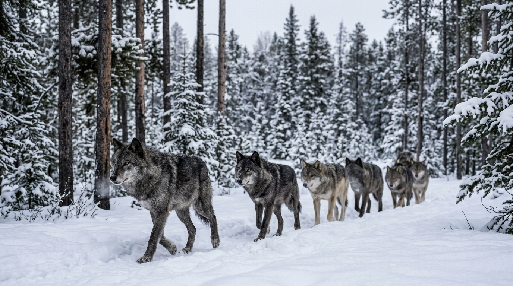
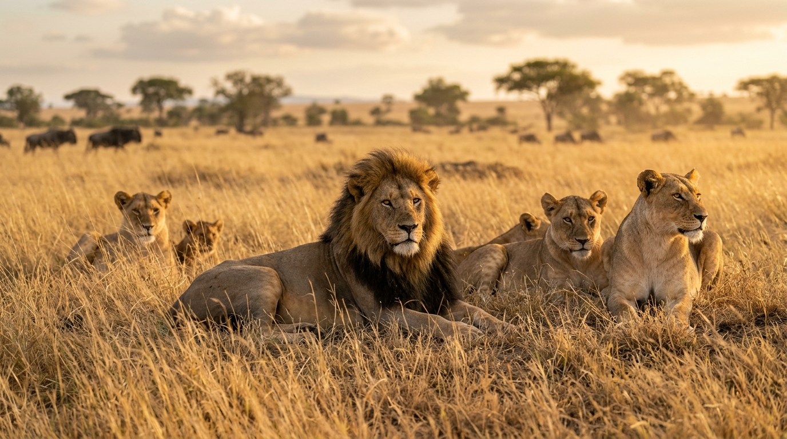
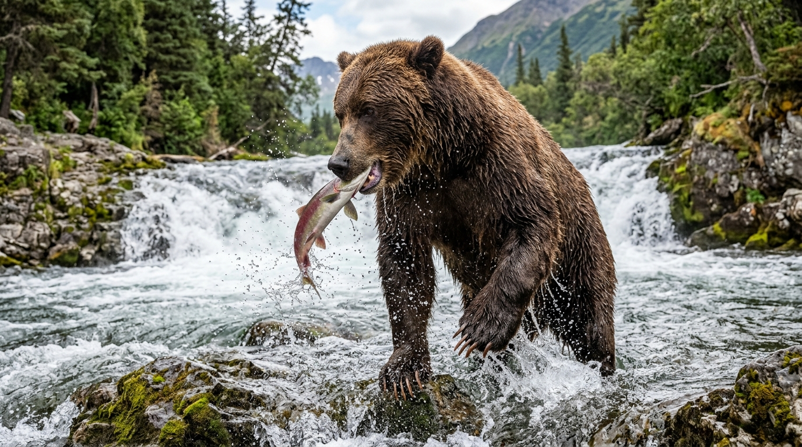

# Introduction

In evolutionary biology and wildlife literature, describing how apex carnivores survive demands a lexicon as sharp as the claws and teeth of the animals themselves. The interactions between predator and prey—and the intricate social hierarchies within hunting groups—are governed by precise scientific and descriptive vocabulary.

This visual dictionary pairs high-definition field photography with rigorous linguistic analysis, exploring the mechanics of **pack dynamics**, the visceral reality of being **mauled**, and the physiological adaptations that define mammalian predators.

***

## 1. Pack Dynamics & Coordinated Canid Hunting

{fig-align="center" width="95%"}

### The Canid Ethology Lexicon

#### Pack (Noun & Intransitive Verb)
*   **Phonetics**: /pæk/
*   **Etymology**: From Middle Dutch or Middle Low German *pak* (bundle, package), evolving by the 15th century to describe a cohesive, organized band of animals or hounds working in concert.
*   **Ethological Definition**: A structured, cooperative social unit—typically composed of an interrelated family group—operating under collective communication, territorial defense, and collaborative hunting strategies.
*   *Collocations*: *Pack hunting*, *pack mentality* (often applied sociologically to human conformism), *leader of the pack*.

#### The Anatomy of the Chase: Stalk, Ambush, and Coursing
Mammalian predators employ distinct predatory strategies based on skeletal morphology:

```text
                  [ PREDATORY HUNTING STRATEGIES ]

       COURSING PREDATORS               AMBUSH & STALKING PREDATORS
       (e.g., Wolves, Painted Dogs)     (e.g., Tigers, Leopards, Cougars)
               │                                      │
               ▼                                      ▼
     Long-distance endurance               Stealth approach (stalking)
     exhaustion of quarry;                 utilizing cover, followed by
     testing herd vulnerability.           an explosive leap (pouncing).
```

*   **Coursing** *(Noun / Verb)*: The pursuit of prey using sight and long-distance cardiovascular stamina rather than concealment. Wolves run down their quarry over kilometers, exploiting weakness and fatigue.
*   **Quarry** *(Noun)*: /ˈkwɒri/ From Old French *cuirée* (the skin and parts of a hunted animal given to hounds, from Latin *corium*, skin). Denotes the targeted animal or prey being pursued in a hunt.
*   **Alpha / Dominance Hierarchy Myth**: Modern wildlife biology (notably L. David Mech) has largely retired the popular concept of the brutal "alpha male" fighting for dominance in wild wolf packs; natural wild packs function primarily as **nuclear family units**, where the breeding male and female guide their offspring.

***

## 2. Pride Structure, Apex Dominance, and Ambush

{fig-align="center" width="95%"}

### The Felid Ethology Lexicon

#### Pride (Noun)
*   **Phonetics**: /praɪd/
*   **Etymology**: From Old English *prȳde* (arrogance, self-esteem), adopted as the specific venereal/collective noun for a congregation of lions by the 15th century.
*   **Social Architecture**: Unlike almost all other felids—which are solitary—lions form permanent matrilineal coalitions of related females, their cubs, and a small coalition of resident males that defend pride territory against rival coalitions.

#### Apex Predator (Noun Phrase)
*   **Phonetics**: /ˈeɪpɛks ˈprɛdətər/
*   **Definition**: A predator residing at the absolute summit of a trophic food web, having no natural predators of its own in its native ecosystem (e.g., lions, orcas, polar bears).
*   **Trophic Cascade**: The ecological phenomenon whereby the presence or removal of an apex predator radically transforms the population dynamics and vegetation of the entire biome.

#### Pounce (Verb & Noun)
*   **Phonetics**: /paʊns/
*   **Definition**: To spring or swoop suddenly upon prey with outstretched claws or talons, delivering kinetic shock to collapse or pin the quarry.
*   *Collocation*: *Pounce on the opportunity* (metaphorical business/strategic idiom).

***

## 3. Ursid Strength and the Visceral Mechanics of "Maul"

{fig-align="center" width="95%"}

### Deep Etymology & Nuance: Maul

#### Maul (Transitive Verb & Noun)
*   **Phonetics**: /mɔːl/
*   **Historical Etymology**: Traces through Middle English *mallen* ("to strike with a heavy hammer") to the Old French *mail*, derived from Classical Latin ***malleus*** (a hammer, mallet).
*   **Evolution of Meaning**: Originally, to *maul* was to crush or hammer violently with a bludgeon. Over centuries of wildlife reporting and legal chronicles, the term shifted from blunt mechanical impact to describe the **tearing, clawing, and lacerating damage inflicted by powerful wild beasts** (primarily bears, big cats, and canids).

```text
               [ ETYMOLOGICAL TRAJECTORY OF 'MAUL' ]

    Latin: MALLEUS ──────► Middle English: MALLEN ──────► Modern English: MAUL
    (Heavy Iron Hammer)    (To beat with a mallet)        (To tear, crush, & lacerate
                                                           with claws and teeth)
```

::: {.callout-important}
### Semantic Nuance: Maul vs. Attack vs. Bite
*   **Attack**: The broad initiating action; an animal can attack without making physical contact or causing injury.
*   **Bite**: A singular puncture or grasp with teeth.
*   **Maul**: Implies **sustained, catastrophic, tearing physical trauma**, combining heavy blunt force with lacerating claw strikes and crushing jaw pressure, leaving disfiguring wounds.
:::

#### High-Register Usages & Metaphorical Extensions
*   *A horrific mauling*: A savage encounter resulting in extensive soft-tissue trauma.
*   *Critical mauling*: In literary or theatrical criticism, a devastating, merciless review that utterly destroys a production. (*"The director's new play received a savage critical mauling."*)

***

## 4. Anatomical Visual Lexicon: Locomotion & Dentition

To read and write about animal behavior with scientific precision, one must distinguish how animals carry their weight and how their teeth are structured for food processing.

### Skeletal Stances: Plantigrade vs. Digitigrade vs. Unguligrade

```text
  PLANTIGRADE                DIGITIGRADE                 UNGULIGRADE
  (Bears, Humans)            (Wolves, Cats)              (Deer, Horses)
      ┌───┐                      ┌───┐                       ┌───┐
      │   │ Heel on              │   │ Heel elevated;        │   │ Tips of toes
      │   │ ground               │   │ walks on toes         │   │ (hooves)
  ════╧═══╧════              ════╧═══╧════               ════╧═══╧════
```

1. **Plantigrade** *(Adjective)*: Walking with the entire sole of the foot—including heel and metatarsals—flat on the ground (e.g., bears, raccoons, humans). Yields maximum stability and wrestling leverage, but limits sprinting efficiency.
2. **Digitigrade** *(Adjective)*: Walking exclusively on the digits (toes), with the wrist and heel elevated high off the ground (e.g., canids, felids). Maximizes stride length, silent stalking, and explosive acceleration.
3. **Unguligrade** *(Adjective)*: Walking on the very tips of the digits, typically shielded by keratinized hooves (e.g., horses, deer, bison).

### The Carnassial Apparatus
Unlike herbivores with flat, grinding molars, true carnivores possess specialized **carnassials**—paired premolars and molars that shear against one another like heavy surgical shears to slice through tough tendons, hide, and muscle fiber.

***

## Diagnostic Synthesis: The Anatomy of an Arctic Hunt

Read the following passage demonstrating how these terms synthesize into rich descriptive prose:

> "The barren-ground caribou herd drifted warily across the tundra, their unguligrade hooves clicking softly against the permafrost. From the ridge above, a **pack** of arctic wolves began their silent, digitigrade approach, keeping downwind to avoid alerting their **quarry**. Rather than launching an immediate sprint, the wolves patiently **coursed** the flanks of the migration, testing the perimeter for any animal slowed by injury. A rogue solitary wolf that attempted to challenge a full-grown grizzly feeding on **carrion** at the riverbank was swiftly **mauled**, serving as a brutal reminder of the physical disparity between opportunistic predators and undisputed **apex** giants."

***

## Knowledge Retention Diagnostic

**1. What is the historical, etymological root of the verb "to maul"?**
A) Old Norse *máll*, meaning a sharp wolf tooth.
B) Latin *malleus*, meaning a heavy iron hammer or mallet.
C) Anglo-Saxon *mūl*, meaning a wide riverbank.
D) Greek *melas*, meaning black darkness.

**2. Which foot posture allows wolves and big cats to achieve silent stalking and explosive sprinting speed?**
A) Plantigrade (heel flat on the ground).
B) Digitigrade (weight supported entirely on the digits/toes).
C) Unguligrade (weight balanced on single hooves).
D) Palmate (webbed toe membranes).

**3. In ethological terminology, what characterizes a "coursing" predator?**
A) Laying in wait in subterranean burrows until prey passes overhead.
B) Relying on sustained cardiovascular endurance to exhaust quarry in an open chase.
C) Luring prey using bioluminescent organs.
D) Scavenging exclusively on decaying carcasses.

**4. What distinct structural feature distinguishes "carnassial" teeth from herbivorous molars?**
A) They are wide, flat millstones designed to crush cellulose.
B) They act as self-sharpening shears designed to slice through flesh and sinew.
C) They are hollow tubes used to extract bone marrow.
D) They are loose incisors that shed annually.

### Explanatory Answer Key
1. **B.** *Maul* descends from Latin *malleus* (hammer), evolving through Middle English *mallen* (to bludgeon) into modern lacerating animal trauma.
2. **B.** *Digitigrade* locomotion elevates the heel and wrist, acting as an extra kinetic shock absorber and lengthening the effective limb for silent locomotion.
3. **B.** Coursing predators (like wolves and hunting dogs) run down their quarry over vast distances, contrasting with short-range ambush stalkers.
4. **B.** Carnassials are specialized shearing teeth unique to the mammalian order Carnivora.

***
© 2026 Igor Kan
